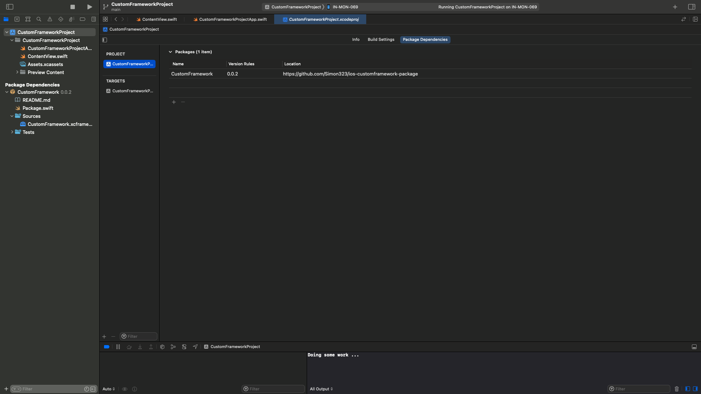

# Install package

In Xcode
1. `File` -> `Add Packages...`
2. In search field paste `https://github.com/Simon323/ios-customframework-package`
3. Select version
    - `0.0.1` - Package with source code
    - `0.0.2` - Package without source code

# Clean build directory

After update / downgrade package from version `0.0.1` <-> `0.0.2` clean build directory.
1. Use shortcut `Product` -> `Clean Build Folder`-> `⇧⌘K` == `Shift + Command + K`
2. Rebuild shortcut `Product` -> `Build` ==  `⌘B` == `Command B`

